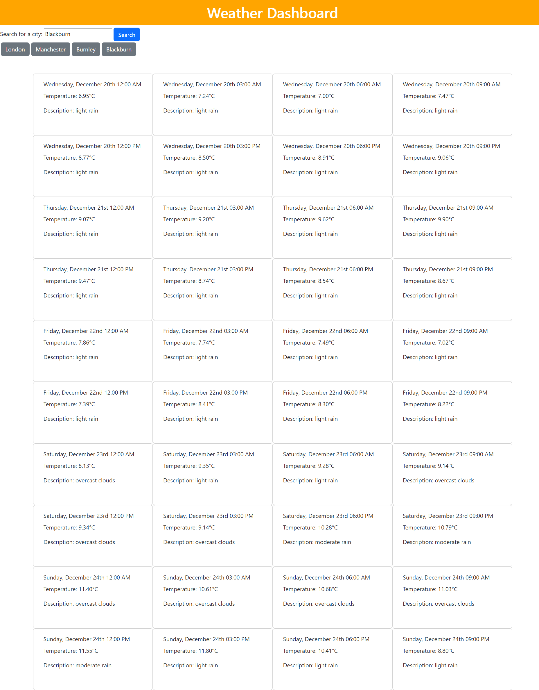

# Weather Dashboard

My solution to the edX front-end bootcamp Module 8 challenge. It's a dashboard that allows you to view the weather for areas you input. It also stores the locations you've previously looked at.

## Usage
Open `index.html` in a web browser. [This site is also hosted on GitHub Pages.](https://iy2k22.github.io/weather-dash/)

## Credits
* [Axios](https://axios-http.com)
* [Bootstrap](https://getbootstrap.com)
* [Day.js](https://day.js.org)
* [jQuery](https://jquery.com)